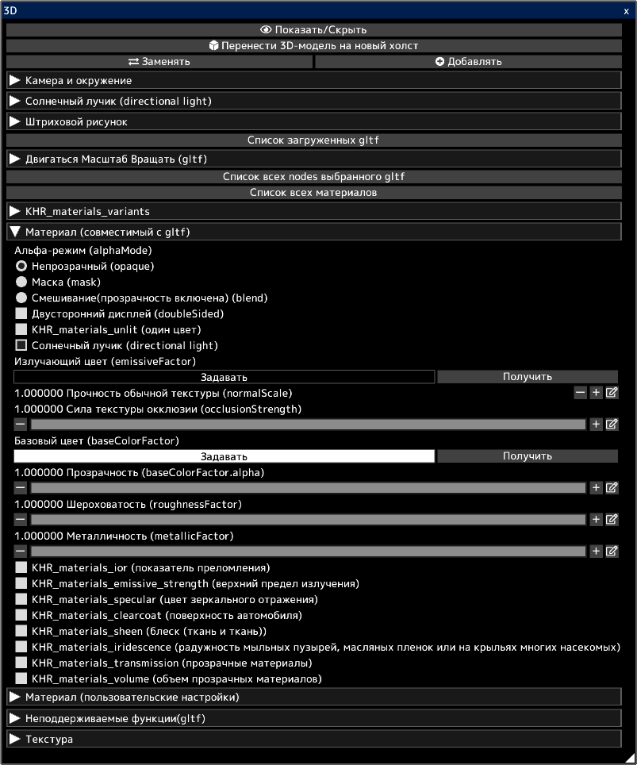

---
hide:
  - toc
---

<!-- https://steamcommunity.com/sharedfiles/filedetails/?id=2964324779 -->

Вы можете открывать 3D-модели в файлах gltf и glb.  
Вы можете перенести внешний вид 3D на 2D-холст как есть.  
Вы также можете перенести штриховую графику 3D на 2D-холст.  
Перенесенный холст можно использовать для создания иллюстрации. Например, используйте его в качестве фона для иллюстрации.

3D-модели можно создавать в 3D-программах, таких как [blender](https://www.blender.org/) или Autodesk Maya.  
Вы также можете скачать 3D-модели с таких сайтов, как [sketchfab](https://sketchfab.com/).

Нажатие кнопки __«Заменять»__ удалит все ранее загруженные 3D-модели и оставит только недавно загруженную 3D-модель.  
Вы можете добавить 3D-модель, нажав кнопку __«Добавлять»__.

Вы можете выбрать один gltf из нескольких загруженных gltf, щелкнув __«Список загруженных gltf»__.  
Вы можете двигаться/вращать/масштаб выбранный gltf.

Вы можете выбрать node (объект) в выбранном gltf, нажав __«Список всех nodes выбранного gltf»__.  
Вы можете двигаться/вращать/масштаб выбранный node.

Вы можете выбрать материал в выбранном gltf, нажав __«Список всех материалов»__.  
Вы можете настроить параметры выбранного материала.

В разделе __«Материал (совместимый с gltf)»__ перечислены параметры материала в соответствии со спецификацией gltf.  
3D-модели, созданные с помощью 3D-программного обеспечения, такого как blender, отражаются в параметрах этого элемента «Материал (совместимый с gltf)».  
[Проверьте этот сайт для сохранения gltf в blender.](https://docs.blender.org/manual/en/latest/addons/import_export/scene_gltf2.html#gltf-2-0)

3D-модели, загруженные с таких сайтов, как [sketchfab](https://sketchfab.com/), могут выглядеть в sketchFab иначе, чем в icpaint.  
В этом случае включение KHR_materials_unlit (один цвет) может дать такой же вид.

* «Солнечный лучик (directional light)» включен для всех материалов при загрузке файлов gltf или glb. Вы можете снять флажок «Солнечный лучик (directional light)» после импорта.
* Точечные источники света не поддерживаются (point light, spot light) (KHR_lights_punctual)
* Анимация 3D-моделей не поддерживается.
* Освещение излучающим цветом (emissiveFactor) и т. д. не поддерживается.
* Он не поддерживает отбрасывание теней для 3D-моделей.
* KHR_draco_mesh_compression, EXT_meshopt_compression, KHR_mesh_quantization не поддерживаются.
* ktx2 (формат изображения) не поддерживается (KHR_texture_basisu)

[Посетите этот сайт, чтобы узнать, как редактировать gltf с помощью текстового редактора.](https://github.com/KhronosGroup/glTF-Tutorials/blob/master/AddingMaterialExtensions/AddingMaterialExtensions_002_UsingVisualStudioCode.md#using-visual-studio-code)

Официальные описания параметров в разделе __«Материал (совместимый с gltf)»__:

* [спецификация gltf](https://registry.khronos.org/glTF/specs/2.0/glTF-2.0.html)
* [описание альфа-режим (alphaMode)](https://registry.khronos.org/glTF/specs/2.0/glTF-2.0.html#alpha-coverage)
* [описание двусторонний дисплей (doubleSided)](https://registry.khronos.org/glTF/specs/2.0/glTF-2.0.html#double-sided)
* [KHR_materials_unlit (один цвет)](https://github.com/KhronosGroup/glTF/tree/main/extensions/2.0/Khronos/KHR_materials_unlit#khr_materials_unlit)
* [основное описание материала](https://github.com/KhronosGroup/glTF-Tutorials/blob/master/gltfTutorial/gltfTutorial_010_Materials.md#materials)
* [KHR_materials_ior (показатель преломления)](https://github.com/KhronosGroup/glTF/tree/main/extensions/2.0/Khronos/KHR_materials_ior#khr_materials_ior)
* [KHR_materials_emissive_strength (верхний предел излучения)](https://github.com/KhronosGroup/glTF/tree/main/extensions/2.0/Khronos/KHR_materials_emissive_strength#khr_materials_emissive_strength)
* [KHR_materials_specular (цвет зеркального отражения)](https://github.com/KhronosGroup/glTF/tree/main/extensions/2.0/Khronos/KHR_materials_specular#khr_materials_specular)
* [KHR_materials_clearcoat (поверхность автомобиля)](https://github.com/KhronosGroup/glTF/tree/main/extensions/2.0/Khronos/KHR_materials_clearcoat#khr_materials_clearcoat)
* [KHR_materials_sheen (блеск (ткань и ткань))](https://github.com/KhronosGroup/glTF/tree/main/extensions/2.0/Khronos/KHR_materials_sheen#khr_materials_sheen)
* [KHR_materials_iridescence (радужность мыльных пузырей, масляных пленок или на крыльях многих насекомых)](https://github.com/KhronosGroup/glTF/tree/main/extensions/2.0/Khronos/KHR_materials_iridescence#khr_materials_iridescence)
* [KHR_materials_transmission (прозрачные материалы)](https://github.com/KhronosGroup/glTF/tree/main/extensions/2.0/Khronos/KHR_materials_transmission#khr_materials_transmission-)
* [KHR_materials_volume (объем прозрачных материалов)](https://github.com/KhronosGroup/glTF/tree/main/extensions/2.0/Khronos/KHR_materials_volume#khr_materials_volume)
