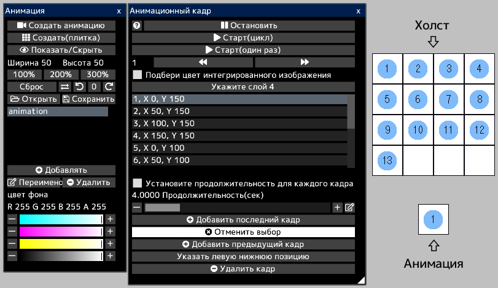
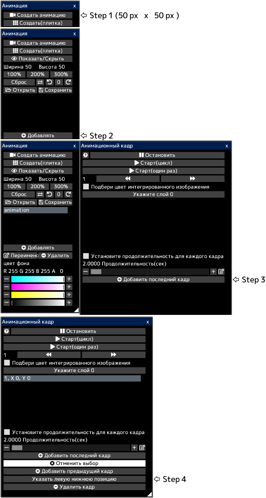
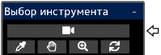

---
hide:
  - toc
---

<!-- https://steamcommunity.com/sharedfiles/filedetails/?id=2963175836 -->

Анимация выражает движение путем непрерывного переключения изображений для каждого кадра.

Каждый кадр представляет собой некоторую область(прямоугольник) на холсте.  
Все кадры отображаются на холсте.

Когда вы открываете анимированный файл gif или webp, создается холст с анимацией, готовой к воспроизведению.  
Однако если размер холста слишком велик, анимация не будет создана.

Например, в этом холсте каждый кадр анимации представляет собой квадратную область с числами от 1 до 13.  
При воспроизведении анимации она будет воспроизводиться следующим образом.

### Как создать анимацию

Сначала создайте холст, который выглядит следующим образом.  
Затем откройте окно «Анимация», нажав кнопку «Окно анимации» в меню «Холст».

Вы создаете 13 кадров.

Вы можете указать нижнюю левую позицию каждого кадра.  
__"1, X 0, Y 150"__ означает, что нижнее левое положение первого кадра равно (0, 150).  
Нижняя левая позиция холста (0, 0).  
В этом примере каждый кадр имеет ширину и высоту 50 px.  
Когда рамка выбрана, на холсте отображается синяя прямоугольная рамка.

Если флажок __«Подбери цвет интегрированного изображения»__ установлен, анимация будет воспроизводиться с текущим внешним видом холста.  
Если этот флажок снят, анимация будет воспроизводиться только с внешним видом указанного слоя.

Анимация будет воспроизводиться при нажатии кнопки __«Старт»__.  
Вы можете изменить положение и размер воспроизводимой анимации, выбрав инструмент анимации.

Вы можете сохранить анимацию в формате gif или webp.  
Поскольку файлы gif имеют ограниченное количество цветов, вы можете сохранить их как файл gif, только если выбран пиксельная графика слой.  
В этом случае вам нужно нарисовать анимацию в пиксельная графика слой.
