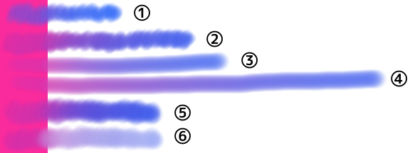

---
hide:
  - toc
---

<!-- https://steamcommunity.com/sharedfiles/filedetails/?id=2966251151 -->

Аэрограф

・ Мягче  
・ Интервалы 0.5  
・ Размер 50  
・ Непрозрачность 20%  
・ Минимальный размер 100  
・ Минимальная непрозрачность 30%

---

・ Мягкий  
・ __Интервалы 0.1__  
・ Размер 8  
・ Непрозрачность 50%  
・ Минимальный размер 0  
・ Минимальная непрозрачность 0%

---

・ Жесткий  
・ __Интервалы 2.0__  
・ Размер 14  
・ Непрозрачность 100%  
・ Минимальный размер 0  
・ Минимальная непрозрачность 100%

---

・ __Изображение круга кисти (star.tga)__  
・ Интервалы 2.0  
・ Размер 14  
・ Непрозрачность 100%  
・ Минимальный размер 0  
・ Минимальная непрозрачность 100%

---

・ Жесткий  
・ Интервалы 2.0  
・ Размер 14  
・ Непрозрачность 100%  
・ Минимальный размер 0  
・ Минимальная непрозрачность 100%  
・ __Текстуры основы кисти (tex.tga)__

---

・ __Изображение круга кисти (star.tga)__  
・ Интервалы 2.0  
・ Размер 18  
・ Непрозрачность 100%  
・ Минимальный размер 0  
・ Минимальная непрозрачность 100%  
・ __Текстуры основы кисти (tex.tga)__

---

・ __Изображение круга кисти (img.tga)__  
・ Интервалы 1.0  
・ Размер 35  
・ Непрозрачность 100%  
・ Минимальный размер 40  
・ Минимальная непрозрачность 40%  
・ Случайный угол 179°

---

・ Мягче  
・ Интервалы 0.3  
・ Размер 20  
・ Непрозрачность 60%  
・ Минимальный размер 70  
・ Минимальная непрозрачность 20%  
・ __Текстуры основы кисти (tex.tga)__

---

・ Мягче  
・ Интервалы 0.3  
・ Размер 20  
・ Непрозрачность 60%  
・ Минимальный размер 70  
・ Минимальная непрозрачность 20%  
・ __Текстуры основы кисти (circle.png)__  
・ Масштаб 30% (Текстуры основы кисти)

circle.png

---

・ Жесткий  
・ Интервалы 2.0  
・ Размер 18  
・ Непрозрачность 100%  
・ Минимальный размер 0  
・ Минимальная непрозрачность 100%  
・ __Эллипс 40%__  
・ Угол 0°

---

・ Жесткий  
・ Интервалы 2.0  
・ Размер 18  
・ Непрозрачность 100%  
・ Минимальный размер 0  
・ Минимальная непрозрачность 100%  
・ __Эллипс 40%__  
・ __Угол 130°__

---

Если верхняя кнопка окна инструментов "__Маркер__", она будет окрашена таким образом, что цвета заменяются.

---

Если верхняя кнопка окна инструментов "__Размытие(Средний)__", она будет окрашена средним цветом рисунка внутри круга кисти.  
Если установлен флажок __«Подбери цвет интегрированного изображения»__, то средний цвет определяется исходя из текущего вида холста.  
Если этот флажок снят, средний цвет определяется на основе того, что нарисовано на текущем слое.

---

Если верхняя кнопка окна инструментов "__Смешивание__"

① Смешанный цвет 70,  Расширенный цвет 70, Количество воды 10  
② Смешанный цвет 90,  Расширенный цвет 70, Количество воды 10  
③ Смешанный цвет 90,  Расширенный цвет 0, Количество воды 10 (рисовать одной линией)  
④ Смешанный цвет 90,  Расширенный цвет 70, Количество воды 10 (рисовать одной линией)  
⑤ Смешанный цвет 90,  Расширенный цвет 0, Количество воды 0  
⑥ Смешанный цвет 90,  Расширенный цвет 0, Количество воды 70

・ Мягкий  
・ Интервалы 0.1  
・ Размер 16  
・ Непрозрачность 20%  
・ Минимальный размер 50  
・ Минимальная непрозрачность 0%
