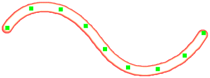

---
hide:
  - toc
---

<!-- https://steamcommunity.com/sharedfiles/filedetails/?id=2971128241 -->

Инструмент "Кривая кисть" позволяет позже изменить мазки кисти.  
Вы можете изменить мазок кисти, щелкая и перемещая контрольные точки.  
Вы также можете изменить параметры кисти.

Перемещая контрольную точку влево/вправо с помощью Shift + щелчок, вы можете изменить нажим пера в положении контрольной точки.

|  | Как использовать |
| ------ | ----------- |
| Переместить контрольную точку       | Щелкните и перетащите контрольную точку |
| Должна ли контрольная точка быть острой или плавной кривой | Ctrl + щелкните контрольную точку |
| Переместите кривую, сохраняя форму кривой       | Shift + Alt + щелкните и перетащите |
| Поверните кривую вокруг места, где щелкнули | Ctrl + Shift + Alt + щелкните и перетащите влево или вправо |

---

・ RGBA (0, 140, 255, 255)  
・ Мягче  
・ Интервалы 20  
・ Размер 50  
・ Непрозрачность 10%

---

・ RGBA (0, 140, 255, 255)  
・ Изображение круга кисти (img.tga)  
・ Интервалы 30  
・ Размер 35  
・ Непрозрачность 100%  
・ Случайный угол 179°

---

・ RGBA (0, 140, 255, 255)  
・ Изображение круга кисти (fur.tga)  
・ Интервалы 7  
・ Размер 30  
・ Непрозрачность 100%  
・ Вращение вдоль мазка кисти

---

・ RGBA (255, 77, 77, 255)  
・ Жесткий  
・ Интервалы 3  
・ Размер 9  
・ Непрозрачность 100%

Двойная кисть

・ RGBA (104, 255, 172, 255)  
・ Мягкий  
・ Добавить(Светиться)  
・ Интервалы 3  
・ Размер 8  
・ Непрозрачность 80%

---

・ RGBA (0, 140, 255, 255)  
・ Изображение круга кисти (splatter.tga)  
・ Интервалы 35  
・ Размер 35  
・ Непрозрачность 100%  
・ Случайный размер 120  
・ Случайная непрозрачность 50%  
・ Случайный угол 179°

---

・ RGBA (255, 0, 0, 255)  
・ Изображение круга кисти (star.tga)  
・ Интервалы 8  
・ Размер 10  
・ Непрозрачность 100%  
・ Случайный размер 110  
・ Случайная положение 250  
・ Случайный угол 179°

Двойная кисть

・ RGBA (255, 255, 0, 255)  
・ Изображение круга кисти (star.tga)  
・ Добавить(Светиться)  
・ Интервалы 8  
・ Размер 7  
・ Непрозрачность 100%  
・ Случайный размер 110  
・ Случайная положение 250  
・ Случайный угол 179°
