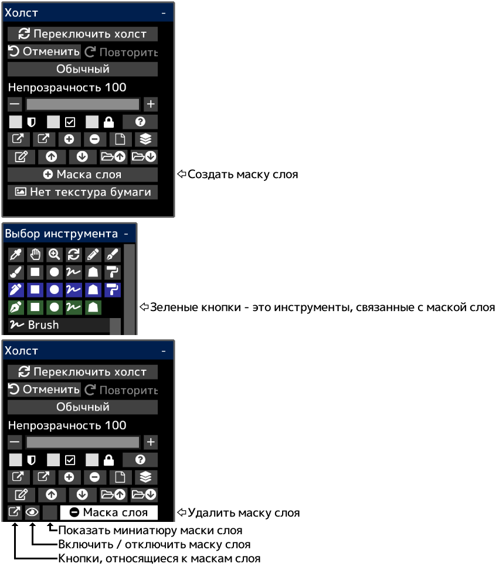

---
hide:
  - toc
---

<!-- https://steamcommunity.com/sharedfiles/filedetails/?id=2953908565 -->

Вы можете частично скрыть содержимое чертежа, используя маску слоя.  
Маска слоя имеет непрозрачность (0 ~ 255).  
Вы также можете создать маску слоя для группы.  
Если вы создаете маску слоя для корректирующего слоя, вы можете настроить часть, на которую будет воздействовать корректирующий слой.
