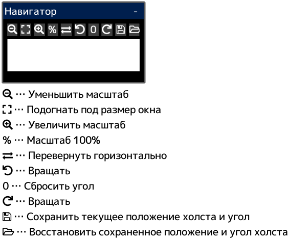

---
hide:
  - toc
---

<!-- https://steamcommunity.com/sharedfiles/filedetails/?id=2954724811 -->

Если щелкнуть внутри окна «Навигатор», холст переместится так, что место щелчка окажется в центре окна приложения.
