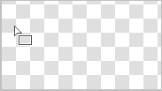
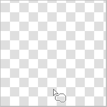
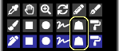

---
hide:
  - toc
---

<!-- https://steamcommunity.com/sharedfiles/filedetails/?id=2968096141 -->

Вы можете выбрать инструмент «Прямоугольник», нажав кнопку ■ в окне «Выбор инструмента».

Пример рисования с помощью RGBA (44,134,245,150)

Пример покраски с установленным флажком __«Скругленные углы»__ и значением 60 %

Пример рисования с включенным флажком __«Рамка»__

Если поставить галочку __«Соотношение сторон»__, можно зафиксировать соотношение высоты и ширины прямоугольника.  
Если вы установите флажок __«px»__, вы можете указать высоту и ширину прямоугольника в пикселях.

### Инструмент «Окружность»

Пример рисования с помощью RGBA (44,134,245,150)

Пример рисования с выбранным переключателем «Мягче»

Пример рисования с установленным флажком __«Эллипс»__ и значением 40.

Пример рисования с выбранным переключателем «Мягче»

### Инструмент «Лассо»

Пример рисования без размытия (RGBA (44,134,245,255))

Пример рисования с размытие 15x15 px (RGBA (44,134,245,150))

Пример рисования с включенным флажком __"Режим визуализации"__ (размытие 3x3 px)

### Инструмент «Многоугольник»

С помощью инструмента «Многоугольник» позиция, на которую нажали, становится вершиной многоугольника.  
Вы можете отменить до одного.

---

Все эти методы рисования также можно рисовать в __«Режим смешивания»__.  
Например, вы можете сделать его темнее, рисуя в режиме наложения «Умножение».  
Также, например, вы можете сделать его ярче, закрасив его беловато-желтым цветом в режиме наложения «Добавить(Светиться)».
