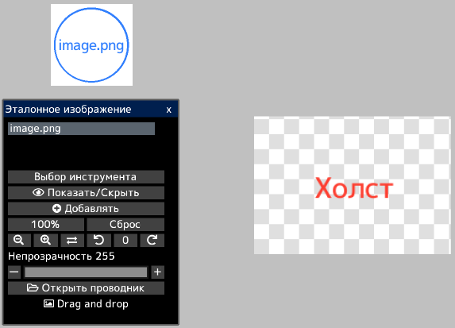
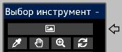

---
hide:
  - toc
---

<!-- https://steamcommunity.com/sharedfiles/filedetails/?id=2966629295 -->

Открыв изображение в окне «Эталонное изображение», вы можете отобразить изображение отдельно от холста.  
Вы можете использовать его как референс при создании иллюстраций.

Вы можете свободно перемещать эталонное изображение, нажав кнопку __«Выбор инструмента»__.  
Вы также можете выбрать инструменты для эталонных изображений в окне «Выбор инструмента».

