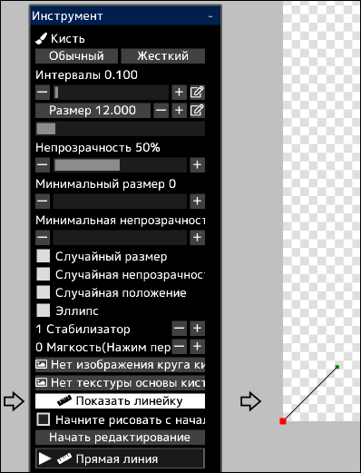

---
hide:
  - toc
---

<!-- https://steamcommunity.com/sharedfiles/filedetails/?id=2969762896 -->

Вы можете рисовать мазки по линейке.

При нажатии кнопки __«Показать линейку»__ линейка будет отображаться в левом нижнем углу холста.  
Эта линейка имеет ту же функцию, что и кривые в векторных слоях.  
Красная точка на линейке — это начальная точка линейки.

Когда флажок __«Начните рисовать с начальной точки линейки(красная точка)»__ не установлен, мазок кисти будет производиться из точки кратчайшего расстояния между точкой касания кистью и линейкой.

Нажав кнопку __«Начать редактирование»__, вы сможете изменить форму линейки.

|  | Как использовать |
| ------ | ----------- |
| Выберите контрольную точку | Щелкните контрольную точку |
| Переместить контрольную точку | Щелкните и перетащите контрольную точку |
| Удалить контрольную точку | Alt + щелкните контрольную точку |
| Должна ли контрольная точка быть острой или плавной кривой | Ctrl + щелкните контрольную точку |
| Добавьте контрольную точку в конец кривой | Щелкните в любом месте, кроме контрольной точки |
| Добавьте контрольную точку в середине кривой | Щелкните в любом месте кривой |
| Добавьте контрольную точку (острый угол) в конец кривой | Ctrl + щелкните в любом месте, кроме контрольной точки |
| Добавьте контрольную точку (острый угол) в середине кривой | Ctrl + щелкните в любом месте кривой |
| Переместите кривую, сохраняя форму кривой | Shift + Alt + щелкните и перетащите |
| Переместите несколько контрольных точек вместе | Shift + щелкните и перетащите, чтобы переместить все контрольные точки внутри круга |
| Масштабировать кривую | Ctrl + Alt + щелкните и перетащите влево или вправо |
| Поверните кривую вокруг места, где щелкнули | Ctrl + Shift + Alt + щелкните и перетащите влево или вправо |

Нажав кнопку __«Закончить редактирование»__, вы снова сможете рисовать кистью.
