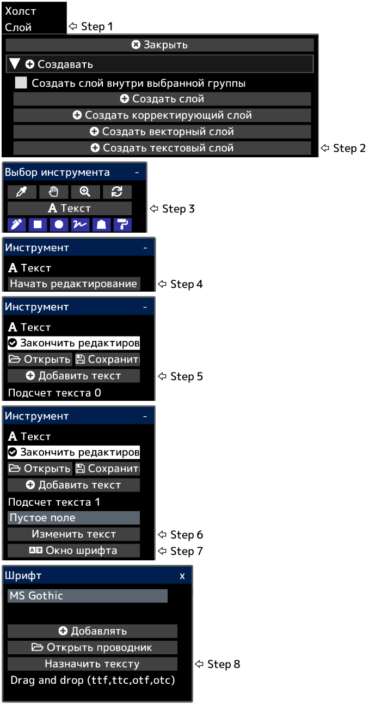

---
hide:
  - toc
---

<!-- https://steamcommunity.com/sharedfiles/filedetails/?id=2954864860 -->

Текст создается в левом нижнем углу холста.  
После нажатия __«Закончить редактирование»__ будут применены непрозрачность слоя, режим наложения, маска слоя и т. д.

Вы можете преобразовать текстовый слой в слой чертежа, нажав кнопку __«Растрировать слой»__ в меню «Слой».
