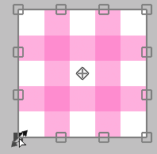

---
hide:
  - toc
---

<!-- https://steamcommunity.com/sharedfiles/filedetails/?id=2955847366 -->

### Если курсор находится внутри области трансформации

Вы можете свободно перемещать его, щелкая.

Вы можете перемещать его только по горизонтали или только по вертикали с помощью Shift + щелчок.

### Если курсор находится за пределами области трансформации

Вы можете повернуть его, щелкая.

Вы можете повернуть его вокруг якоря, нажав Ctrl + щелчок.

### Если курсор находится на якоре

Вы можете перемещать только якорь, щелкая мышью.

### Если курсор находится на верхнем, нижнем, левом или правом краю ( □ )

Вы можете переместить край, щелкнув.

Вы можете перемещать обе стороны одновременно, не перемещая центральную позицию, нажав Alt + щелчок.

Вы можете свободно перемещать край, нажав Ctrl + щелчок.

Вы можете переместить ребро вдоль его направления, нажав Ctrl + Shift + щелчок.

### Если курсор находится на 4 вершинах ( □ )

Вы можете переместить вершину, щелкнув.

Вы можете масштабировать и вращать его с помощью Alt + щелчок.

Вы можете равномерно масштабировать его, нажав Shift + щелчок.

Вы можете масштабировать его равномерно, не перемещая центральное положение, нажав Shift + Alt + щелчок.

---

Вы можете свободно перемещать только вершину, нажав Ctrl + щелчок.  
При этом внешний вид меняется тремя способами.

#### Ctrl + щелчок в «Трансформирование»

#### Ctrl + щелчок в «Перспективное преобразование» с отключенной «Перспектива»

#### Ctrl + щелчок в «Перспективное преобразование» с включенной «Перспектива»

Вернуться в состояние до трансформации можно, нажав кнопку __«Сброс»__.

* Трансформирование(размер холста)
* Двигаться Масштаб Вращать(размер холста)
* Перспективное преобразование
* Фильтра пластика
* Фильтра ретуширование

Эти пять методов могут сохранить содержимое преобразования.  
Если сохранено, вы можете применить то же преобразование к другому слою.

Если вы хотите преобразовать, указав числовое значение, используйте __«Двигаться Масштаб Вращать»__.  
Например, если вы хотите уменьшить его до 50 % или повернуть на 45 градусов.
