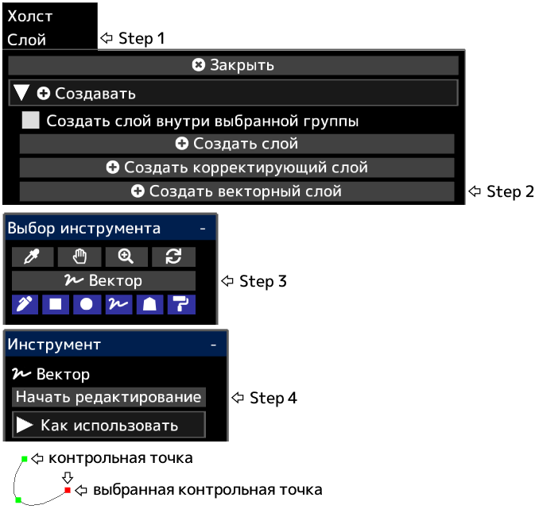

---
hide:
  - toc
---

<!-- https://steamcommunity.com/sharedfiles/filedetails/?id=2955216227 -->

После нажатия __«Закончить редактирование»__ будут применены непрозрачность слоя, режим наложения, маска слоя и т. д.

Вы можете преобразовать векторный слой в слой чертежа, нажав кнопку __«Растрировать слой»__ в меню «Слой».

|  | Как использовать |
| ------ | ----------- |
| Выберите контрольную точку | Щелкните контрольную точку |
| Отмените выбор контрольной точки | Alt + щелкните в любом месте, кроме контрольной точки |
| Переместить контрольную точку | Щелкните и перетащите контрольную точку |
| Удалить контрольную точку | Alt + щелкните контрольную точку |
| Должна ли контрольная точка быть острой или плавной кривой | Ctrl + щелкните контрольную точку |
| Добавьте контрольную точку в конец кривой | Щелкните в любом месте, кроме контрольной точки с выбранной контрольной точкой |
| Добавьте контрольную точку в середине кривой | Щелкните в любом месте кривой с выбранной контрольной точкой |
| Добавьте контрольную точку (острый угол) в конец кривой | Ctrl + щелкните в любом месте, кроме контрольной точки с выбранной контрольной точкой |
| Добавьте контрольную точку (острый угол) в середине кривой | Ctrl + щелкните в любом месте кривой с выбранной контрольной точкой |
| Создайте контрольную точку как другую кривую | Щелкните в любом месте, кроме контрольной точки, если контрольная точка не выбрана |
| Создайте контрольную точку (острый угол) как другую кривую | Ctrl + щелкните в любом месте, кроме контрольной точки, если контрольная точка не выбрана |
| Удалить кривую | Повторите Alt + щелкните по всем контрольным точкам или нажмите кнопку «Удалить кривую» |
| Переместите кривую, сохраняя форму кривой | Shift + Alt + щелкните и перетащите с выбранной контрольной точкой |
| Дублируйте кривую | Ctrl + Shift + щелкните и перетащите с выбранной контрольной точкой |
| Переместите несколько контрольных точек вместе | Shift + щелкните и перетащите, чтобы переместить все контрольные точки внутри круга |
| Масштабировать кривую | Ctrl + Alt + щелкните и перетащите влево или вправо |
| Поверните кривую вокруг места, где щелкнули | Ctrl + Shift + Alt + щелкните и перетащите влево или вправо |
